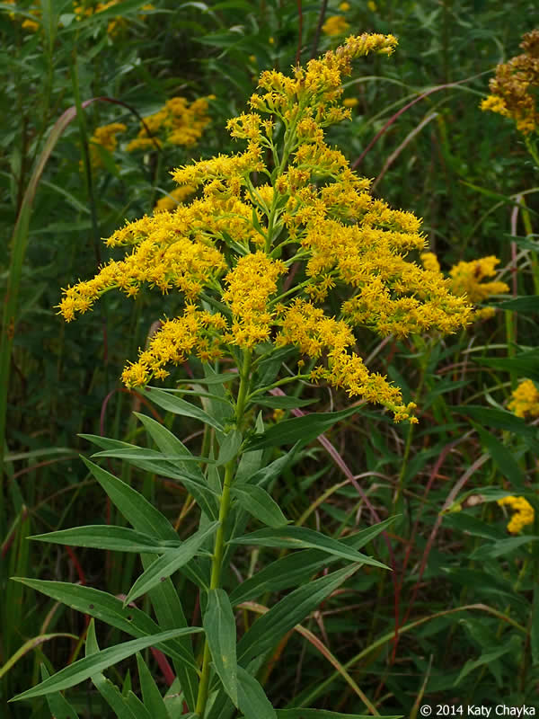
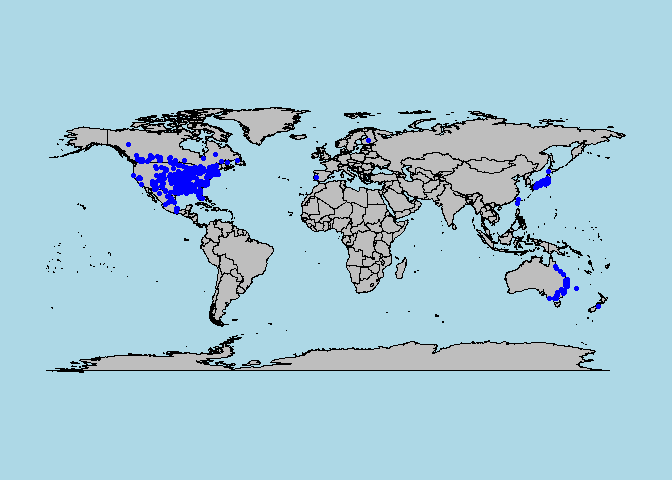
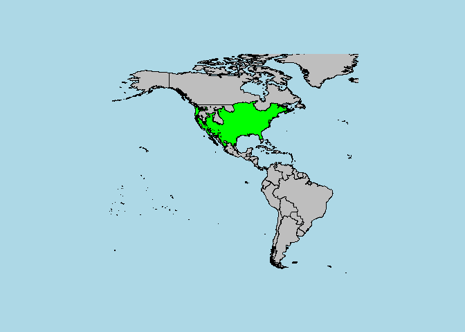
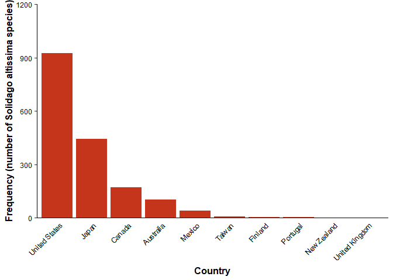

# Frequency of *Solidago altissima* in North American and Canadian regions

Tyler Edvall

Biosciences Department, Minnesota State University Moorhead, 1104 7th
Avenue South, Moorhead, MN 56563 USA

## Abstract

*Solidago altissima* is a Northern American species of goldenrod plant.
They are often found across large areas of the United States, northern
parts of Mexico, and Canada. *Solidago altissima* is unique due to its
tolerance of landscapes which have had human disturbance. This unique
trait has allowed the plant to grow widespread in the North
American/Canadian region. The question I will answer explores if there
is a higher frequency of *solidago altissima* plants in areas of the
United States compared to Canada. Data being used for this question
comes from the “BIEN” database, which is the “Botanical Information and
Ecology Network”. Within this database, there is an option to search for
worldwide data observations on a specific plant species. I will use
exploratory data analysis to answer my question. The two variables that
will be compared in the dataset are the observations, and the country. I
will separate the observations variable by “specimen” and the country
variable by “United States” and “Canada”. The purpose of this research
question would relate to ecological conservation and in what human
disturbed areas sol*idago altissima* growth frequency is higher. As well
as, studying how plants can better adapt to the rapidly growing human
disturbed areas. Although the species can tolerate the rough conditions
created by humans, I would predict for *solidago altissima* to have a
higher species frequency in less human disturbed area, such as Canada.
Areas disturbed by humans can create harsh terrain for life to survive
in. Certain negative terrain characteristics present could prove to be
nutrient taxing, along with other threats that could pose a greater risk
to the fitness of *solidago altissima*.

## Introduction

*Solidago altissima* (also known as the tall goldenrod) is a Northern
American species of goldenrod wildflower and a member of the Asteraceae
Sunflower family. It has a central stem, or stem clusters, 2 to 6 feet
tall supporting masses of small, dark yellow, plume-like flowers. They
are often found across large areas of the United States, northern parts
of Mexico, and Canada. On rare occasions, *solidago altissima* has been
recorded in areas such as Japan, Africa, and southern parts of Asia.
Their native habitat includes dry to moist roadsides, thickets, prairies
& open woods, making *solidago altissima* common in human populated
areas. *Solidago altissima* is unique due to its tolerance of landscapes
which have had human disturbance. The plant is able to tolerate uneven
terrain, and has modest growing demands, which is the reason for their
high tolerance of human disturbed landscapes. Another unique trait is
the plant’s high plasticity to various soil types. *Solidago altissima*
is able to grow in moist to dry soils, clay, clay loam, medium loam,
sandy loam, sandy, and caliche type soils. These unique traits have
allowed the species to most frequently grow widespread in the North
American/Canadian region. As well as, survive rough terrain caused by
human disturbance.

## Methods

# Data Acquisition

I obtained *solidago altissima* data from the Botanical Information and
Ecology Network (Brian Maitner 2020). The data obtained consisted of the
species occurrence of *solidago altissima* from the (BIEN) package
(Brian Maitner 2020). The species occurrence data was used to create a
map of species range, and for further data analysis.

# Data Preparation

-I obtained the data based off of species occurrence from the
library(BIEN) package (Brian Maitner 2020).

-I used the (ape) function from the BIEN package (Brian Maitner 2020)
for working with the *solidago altissima* phylogeny in R.

-I used (maps) and (sp) functions within the BIEN package (Brian Maitner
2020) for making quick maps of occurrences. The (map) function created
the base map, (points) function plotted occurrences of *solidago
altissima*, (plot) function added a map of *solidago altissima’s* range.

-I used the (filter) function in base R (R Core Team 2020) to arrange
the *solidago altissima* data by species, species occurrence, new world
only, country, United States, and Canada.

-I used the (count) function in base R (R Core Team 2020) to count the
*solidago altissima* frequency in both United States and Canada.

-Within the (data.frame) of the *solidago altissima* data, I sorted by
oldest instance of year. This allowed me to find the time-span of data
collection on *solidago altissima*. The years 1836 to 2016.

## Results

Figure 1: *Solidago altissima* species frequency map across both the new
world and old world. Blue spots indicate species instances.

<!-- -->

Figure 2: *Solidago altissima* species frequency map restricted to new
world only. Green spots indicate species instances.

<!-- -->

Figure 3: Bar graph of *solidago altissima* species occurrence per
country.

<!-- -->

The general trend seen in the data displays the highest species
frequency being in the United States. Followed closely by Japan, then
Canada.

## Discussion

When examining the species frequency of *solidago altissima* in regard
to location, North America (specifically the United States and Canada)
has the largest species frequency, followed by Asia (the highest being
in Japan). While previously collected data on the reason for *solidago
altissima’s* high frequency in North America is low, there are a few
possibilities to explain this occurrence. As previously stated,
*solidago altissima* has a naturally high tolerance for growing in human
disturbed areas. The United States 2020 population is just under nine
times that of Canada’s 2020 population (Worldometers.info 2020). This
large difference in populations could suggest a trend in *solidago
altissima’s* growth dispersion. If the overall species has undergone
evolution to better adapt to modern human behavior, it would infer a
relationship between country population size and species frequency of
*solidago altissima*. An instance of a reduced country population could
decrease the abundance of harsh terrain caused by human disturbances.
Conversely, *solidago altissima* may have originated and or evolved
within the United States exclusively for a large duration of its
development as a species. A union of these two concepts could result in
the ecological dispersion of *solidago altissima* that we currently
observe.

## References

Maitner B (2020). BIEN: Tools for Accessing the Botanical Information
and Ecology Network Database. R package version 1.2.4.
<https://CRAN.R-project.org/package=BIEN>

R Core Team (2020). R: A language and environment for statistical
computing. R Foundation for Statistical Computing, Vienna, Austria. URL
<https://www.R-project.org/>.

Wickham H (2016). ggplot2: Elegant Graphics for Data Analysis.
Springer-Verlag New York.

Wickham H, François R, Henry L, and Müller K, (2020). dplyr: A Grammar
of Data Manipulation. R package version 1.0.2.
<https://CRAN.R-project.org/package=dplyr>

Worldometers.info (2021). Real Time World Statistics. Worldometer.
<https://www.worldometers.info/>

R version used: 3.6.3

BIEN version used: 4.1.1. 2018-12-06
